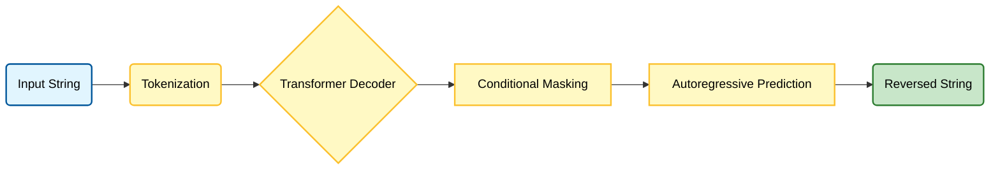

# Ignite Mirror Transformer: A Conditional Decoder-Only Implementation
* Author: Leelakrishna Rajasimha Yadav Doddakula
* Date: 6 Feb 2026

* This repository contains a production-ready implementation of a Decoder-only Transformer optimized for the task of string reversal. By utilizing a conditional sequence modeling approach, the system achieves near-perfect accuracy with minimal computational overhead.

## Project Overview
* This project implements a Decoder-only Transformer designed specifically for string reversal. Unlike standard Seq2Seq models that use separate Encoders and Decoders, this architecture treats reversal as a conditional sequence modeling task.

## Technical Implementation
### Architecture
* Model Type: Decoder-only Transformer with 4 layers and 8 attention heads.

* Positional Encoding: Sinusoidal encodings used to handle sequences up to 128 characters.

* Logic: The model processes a concatenated sequence: [Input String] + [EOS] + [Reversed String].

### Conditional Loss Masking
* The training engine utilizes a custom masking strategy in trainer.py:

* The loss is calculated only for the second half of the sequence (the reversal).

* Gradients for the input prompt are zeroed out, ensuring the model focuses entirely on the transformation logic.

## System Workflow

## Performance & Evaluation
#### Training Metrics
* Dataset Size: 30,000 synthetic samples.

* Convergence: Final Cross-Entropy Loss of 0.0014 achieved after 30 epochs.

* Hardware: Optimized for execution on NVIDIA RTX 4050.

#### Loss Curve Visualization
* The following graph demonstrates the stable convergence and efficient learning rate of the implementation:

## Repository Structure
The project is refactored into a modular hierarchy to ensure scalability and ease of testing:
1. main.py: Serves as the primary entry point for the training and evaluation pipelines.
2. model.py: Defines the Transformer architecture, including the core layers and causal attention mechanism.
3. trainer.py: Manages the PyTorch Ignite engine logic, including custom event handlers and training loops.
4. config.yaml: Centralizes all hyperparameter configurations, such as batch size, learning rate, and model dimensions.
5. predict.py: Provides an interactive command-line interface (CLI) for real-time model validation and testing.

## Quick Start
#### Installation
pip install torch pytorch-ignite pyyaml matplotlib

#### Usage
* Train: python main.py config.yaml

* Inference: python predict.py

